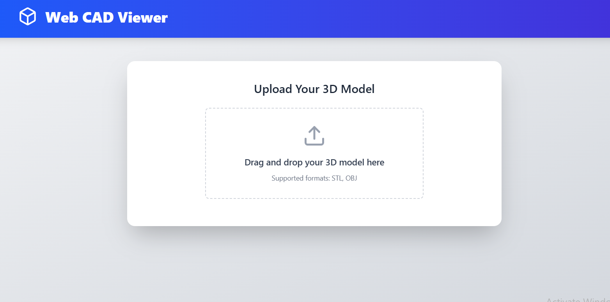
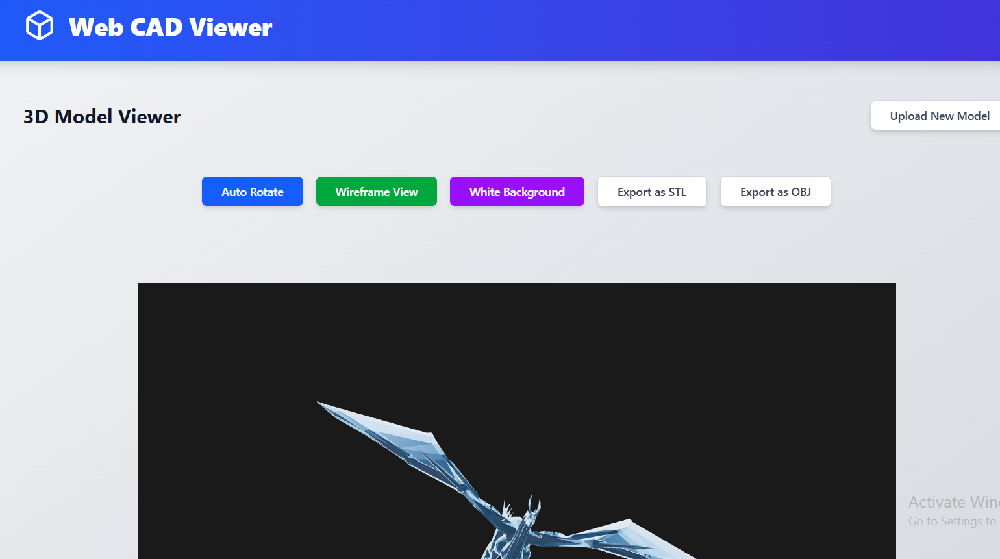
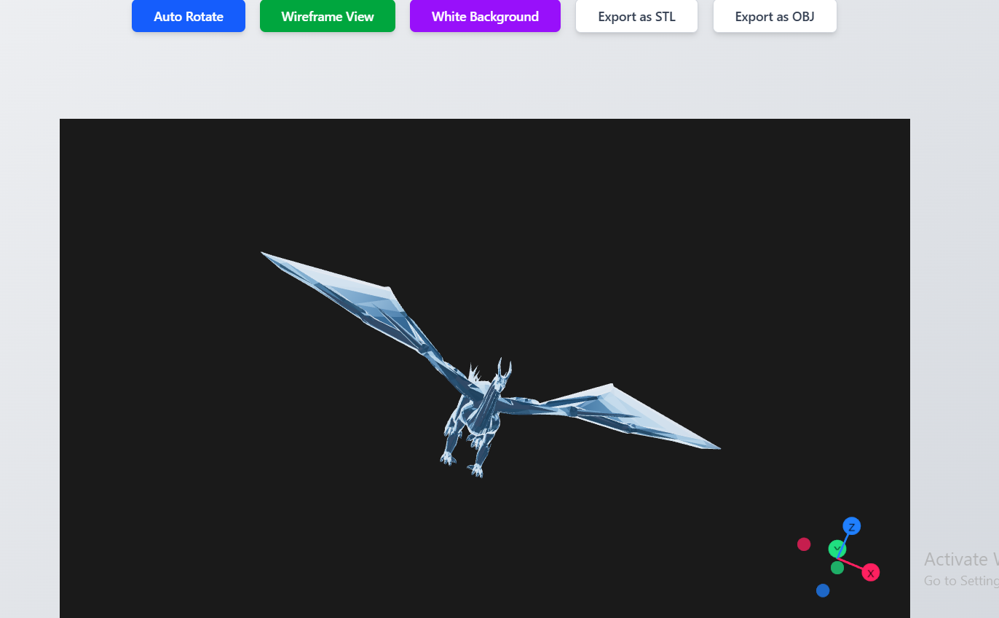

# 🏗️ 3D CAD Viewer

Welcome to **CAD VIEWER**! 🚀 This is a **3D CAD Viewer** that allows users to upload and view **STL and OBJ files** directly in their browser. Built using **React, TypeScript, and Three.js** on the frontend, and **Node.js with Express.js** on the backend. 🎨📐

## 📂 Project Structure

```
└── tarun516-cad-viewer/
    ├── backend/              # Backend (Node.js & Express)
    │   ├── package.json      # Backend dependencies
    │   ├── server.js         # Express server
    │   └── uploads/          # Uploaded STL/OBJ files
    ├── frontend/             # Frontend (Vite + React + TypeScript)
    │   ├── src/
    │   │   ├── components/   # UI Components
    │   │   │   ├── FileUpload.tsx
    │   │   │   ├── ModelViewer.tsx
    │   │   ├── App.tsx       # Main App Component
    │   ├── index.html        # Root HTML File
    │   ├── package.json      # Frontend dependencies
    │   ├── vite.config.ts    # Vite Configuration
    └── README.md             # Project Documentation
```

## ✨ Key Features

- 🔼 **Upload and View STL & OBJ Files** – Users can upload **STL and OBJ files** which are processed and displayed in the 3D viewer.
- 📐 **Interactive 3D Model Viewer** – The viewer, powered by **Three.js**, supports **rotation, zooming, and panning** for an immersive experience.
- 🔄 **Convert Between STL & OBJ Formats** – The backend supports **format conversion**, allowing users to download models in either **STL or OBJ format**.
- 🚀 **Fast and Efficient** – Uses **Vite** for a fast frontend build and **Three.js** for optimized 3D rendering.
- 🎨 **Customizable Viewing Options** – Toggle **wireframe mode, background color, and auto-rotation** for better visualization.
- 🌐 **Backend API for File Management** – Uses **Express.js and Multer** to handle file uploads and downloads.

## 🛠️ Approach

Our approach focuses on **efficiency, usability, and performance**:

- **Modular Development** – The project is structured into separate frontend and backend components, ensuring easy scalability and maintainability.
- **Optimized 3D Rendering** – We use **Three.js** for real-time model visualization with features like auto-rotation, lighting, and camera controls.
- **Seamless File Handling** – The **Multer middleware** in Express.js handles file uploads efficiently, ensuring smooth user experience.
- **Format Conversion** – The backend enables conversion between **STL and OBJ** formats using **Three.js utilities**, making it easy to work with different file types.
- **Customization and Interaction** – Users can switch between **wireframe and solid view**, change background themes, and enable auto-rotation for enhanced interaction.

## 🚀 Getting Started

### 🔧 Prerequisites

Ensure you have **Node.js** and **npm/yarn** installed.

### 🛠️ Installation

#### 1️⃣ Clone the repository

```sh
git clone https://github.com/tarun516/tarun516-cad-viewer.git
cd tarun516-cad-viewer
```

#### 2️⃣ Install dependencies

##### Backend:

```sh
cd backend
npm install
```

##### Frontend:

```sh
cd ../frontend
npm install
```

### ▶️ Running the Application

##### Start Backend Server:

```sh
cd backend
node server.js
```

##### Start Frontend:

```sh
cd frontend
npm run dev
```

Now open **[http://localhost:5173](http://localhost:5173)** in your browser! 🌍

## 📌 How It Works

1. **File Upload**: Users can upload STL or OBJ files using the **upload button**. The backend stores them and returns the file details.
2. **3D Model Rendering**: The frontend uses **Three.js** to display models interactively.
3. **File Conversion**: Users can export models in different formats (STL <-> OBJ) using the backend conversion logic.
4. **Customization**: Users can toggle **wireframe view**, **background color**, and **auto-rotation** for a better experience.

## 📸 Screenshots (Coming Soon) 📷







## 💡 Tech Stack

| Tech        | Description                 |
| ----------- | --------------------------- |
| React.js    | Frontend UI Library         |
| Vite        | Lightning-fast Dev Server   |
| TypeScript  | Typed JavaScript            |
| TailwindCSS | Utility-first CSS Framework |
| Node.js     | Backend Runtime             |
| Express     | Backend Framework           |
| Three.js    | 3D Rendering Library        |
| Multer      | File upload handling        |

---

Enjoy using **3D CAD Viewer**! 🎉🚀

